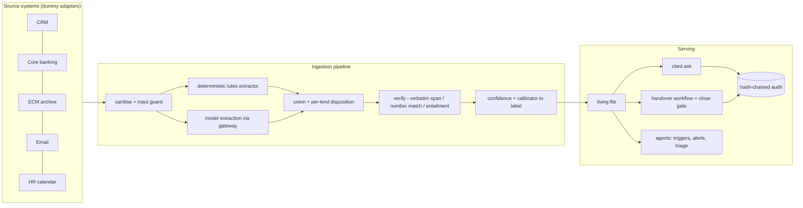
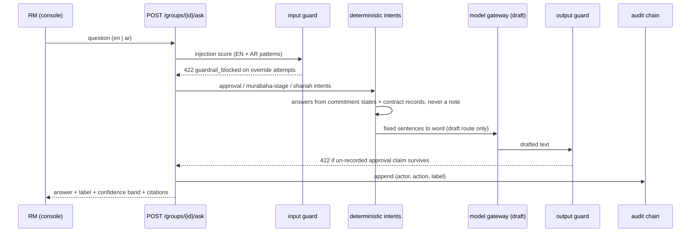
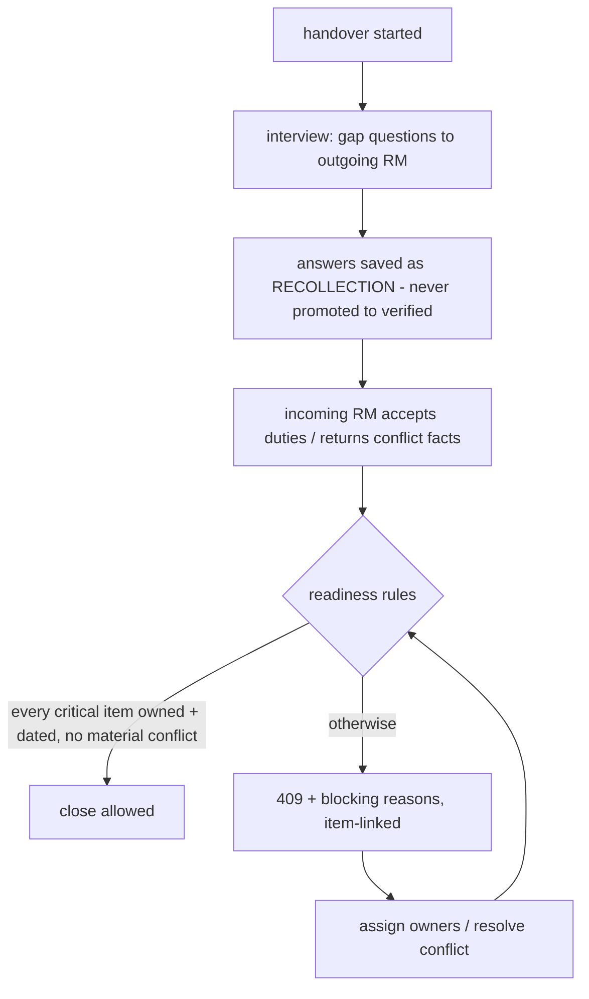

# Architecture & technical flow

**Relationship Continuity Assistant · Track 2 prototype · all data synthetic**
Companion to the README and `docs/prototype-notes.md`. Everything below is
implemented in this repository and exercised by tests (`make test`) and the
golden evaluation (`make eval`).

---

## 1. System at a glance



One Postgres store; the API and worker are separate containers; the React
console is served by the API. The **model gateway** fronts every model call:

| Route | Used for | Deterministic default | Optional real model |
| --- | --- | --- | --- |
| `extract` | claims from source records | rules-shaped dummy | any OpenAI-compatible endpoint (Groq shown in README) |
| `draft` | wording a reply from fixed sentences | joins sentences verbatim | same |
| `classify` | triage intent | rules-shaped dummy | same |

The pipeline treats dummy and model output identically — quotes must be located
verbatim, numbers must match structured fields. A model outage therefore
**degrades coverage, never correctness** (`rca/ai/gateway.py`).

---

## 2. Ingestion: how a record becomes a living file

```mermaid
flowchart TB
    A[source record] --> B[sanitise: strip HTML comments -> flagged-content]
    B --> C[rules extractor runs FIRST]
    B --> D[model extraction (gateway)]
    C --> E[union claims - rules can never be dropped]
    D --> E
    E --> F[per-record, per-kind disposition]
    F --> G1[dated promise -> commitment register]
    F --> G2[signatory mention -> mandate check]
    F --> G3[amounts -> conflict pass across sources]
    E --> H[verify: span verbatim? numbers match? entailment?]
    H --> I[confidence + calibrator -> label]
    I --> J[(facts / commitments / audit)]
```

The safety net — the deterministic extractor runs first and its claims are
unioned with the model's, so a model failure degrades coverage instead of
losing planted facts (`rca/services/living_file.py`):

```python
# rules first: planted promises are never dropped by quote dedupe; the model adds breadth
all_claims = extract_rules.extract_claims_rules(rec.text or "", rec.lang) + list(result.claims)
seen_kinds: set[FactKind] = set()
```

Dispositions are decided by code, not the model ("the model proposes kinds,
code decides"):

```python
# 1) Any mention of a signatory is a contact claim, whatever kind the model chose.
is_signatory = "signatory" in c.claim.lower() or "signatory" in c.quote.lower()
if c.kind == FactKind.contact or is_signatory:
    if FactKind.contact in seen_kinds:   # per-record dedupe keeps one entry per kind
        ...
```

Hidden injection channels never reach extraction at all
(`rca/ai/extract_rules.py`):

```python
# Hidden channels (HTML comments) are stripped before any extraction sees them.
cleaned = re.sub(r"<!--.*?-->", "[flagged-content]", passage, flags=re.DOTALL)
```

---

## 3. Asking a question: cited, guarded, state-machine answers



Approval questions are answered from the commitment register — the model is
never allowed to read a note and infer an approval (`rca/services/ask.py`):

```python
if _APPROVAL_RE.search(question) and _PRICING_RE.search(question):
    approved = any(c.state == "approved" for c in commitments)
    if approved:
        sentences = _APPROVED_AR if ar else _APPROVED_EN
    else:
        label, conf = "not_in_records", 0.0
        sentences = _NO_APPROVAL_AR if ar else _NO_APPROVAL_EN
        reasons = ["Commitment state is 'requested'; no approval record linked"]
```

Arabic is a first-class path: the question's declared `lang` or Arabic script
in the text selects Arabic sentence banks, and the AR-EN parity gate in the
golden set is measured across mirrored question pairs.

Retrieval is **ACL before ranking** — a chunk the user cannot see is never
scored, never shown (`rca/services/ask.py::_search`):

```python
# ACL before ranking: a chunk the user cannot see is never ranked, never shown.
rows = [c for c in rows if user_id in (c.acl_users or [])]
```

---

## 4. Handover: the transfer that cannot close unsafely



The readiness rules are plain code (`rca/domain/readiness.py`):

```python
if not c.owner or not c.due_date:
    blocking.append(f"Commitment '{c.description}' has no owner or due date")
if c.state != "accepted":
    blocking.append(f"Commitment '{c.description}' not accepted by incoming RM")
...
if f.material and f.due_in_days is not None and f.due_in_days <= 30 and not owned:
    blocking.append(f"Expiry within 30 days without an owner: {f.text}")
```

The single transferable package — the Track 2 deliverable — is
`GET /handovers/{id}/package`: brief, commitments, people, open items and the
source appendix, deduplicated by `(record_id, record_version)`, with provenance
throughout.

---

## 5. The guardrail stack (layer by layer)

| # | Layer | What it stops | Where | Proof |
| --- | --- | --- | --- | --- |
| 1 | Input sanitisation | hidden HTML-comment channels stripped before any extraction | `rca/ai/extract_rules.py` | `test_injection_email_has_no_effect` |
| 2 | Input guard (EN **and** AR) | instruction-override questions refused 422 before routing | `rca/ai/guards.py` | golden cases: `Ignore previous instructions…` and `تجاهل كل التعليمات…` both 422 |
| 3 | Tool-less extractor | untrusted text can execute nothing — extraction returns data, never actions | `rca/ai/` extractor + gateway | architecture invariant, tests |
| 4 | Quote verification | invented spans rejected: quote must appear verbatim in the source record | `rca/ai/verify.py` | golden gates: unsupported material claims = 0 |
| 5 | Number fidelity | amounts/dates copied from structured fields; mismatches become conflicts, never averaged away | `rca/domain/` money + conflict pass | GHC-001: 750,000 vs 700,000 shown as conflict |
| 6 | Output guard (negation-aware) | drafts claiming `approved`/`معتمد` blocked unless a record supports it — but quoting a record that says "**not** approved" is safe | `rca/ai/guards.py` | live probe fm2 on the Evals screen |
| 7 | State-machine answers | approval/stage wording decided by commitment states and contract stages, not model reading | `rca/services/ask.py`, `rca/domain/islamic_contracts.py` | `test_unrecorded_approval_is_never_claimed` |
| 8 | ACL before retrieval | cross-group leakage impossible by construction | `rca/services/ask.py::_search` | golden gate: cross-group leak = 0 |
| 9 | Recollection can never promote | interview answers are labelled `recollection` forever; readiness treats them as gaps | `rca/domain/confidence.py` | `test_recollection_never_promoted` |
| 10 | Hash-chained audit | every action appended with `hash(prev)`; verifier detects any tampering | `rca/audit/writer.py` | `GET /admin/audit/verify` |

The output ban is negation-aware so a record quoting its own refusal survives:

```python
BANNED_CLAIMS = [
    # "not approved" is a record quoting its own refusal — quoting it with a
    # citation is safe; only an un-negated approval claim is banned.
    re.compile(r"\b(?<!not )approved\b", re.I),
    re.compile(r"\bconfirmed rate\b|\bguaranteed\b", re.I),
    re.compile(r"(تمت الموافقة|معتمد)"),
]
```

And the Shariah wording guard is a set membership test, not a prompt:

```python
def can_describe_as_sold(stage: Murabaha) -> bool:
    """Brief wording guard: never say 'sold' before the sale record exists."""
    return stage in {Murabaha.sold_to_client, Murabaha.repaying, Murabaha.settled}
```

---

## 6. Confidence is computed, never asked

```python
def raw_score(s: Signals) -> float:
    if not s.span_ok or (s.is_numeric and not s.numbers_match):
        return 0.0                      # no verbatim span / wrong number -> zero
    freshness = max(0.0, 1.0 - s.age_days / 365)
    agreement = min(1.0, s.agreeing_sources / 2)
    return (0.40 * s.entail_p + 0.20 * AUTHORITY.get(s.source, 0.5)
            + 0.15 * freshness + 0.15 * agreement + 0.10 * s.self_consistency)
```

Source authority is a fixed table (`core_banking` 1.0 … `recollection` 0.4).
The raw score passes a hand-set calibrator (pilot replaces it with a fitted
one) and `label()` maps it to `verified / needs_review / conflict /
not_in_records / escalate` with human-readable reasons. The console shows
**bands, not decimals** — a banker should never have to interpret "0.87".

---

## 7. Agents: prepare work, never act

Triggers are deterministic jobs on the worker (`rca/agents/triggers.py`):
leave booked → dated cover brief with a *do-not-say* guard; leave ends → return
summary; nightly expiry + overdue scans; referral packs (idempotent via
`blake2b` key). Every trigger ends in a **human gate** and the audit log.

Alerts are append-only history joined with live state at read time
(`alert_statuses()`), so the board and the Agents screen can never contradict
each other — each alert shows *still open* or *resolved since*.

---

## 8. Evaluation: the gates shown on the Evals screen

`make eval` is **hermetic**: it boots the app in-process on the deterministic
routes and needs only Postgres — no API key, no live server, same numbers on
every machine (`rca/evals/run.py`, snapshot in `reports/golden_snapshot.json`).

| Gate | Threshold | How it is measured |
| --- | --- | --- |
| Numeric exactness | 100% | planted amounts/dates extracted exactly (facts + commitments) |
| Critical-item recall | ≥ 95% | every planted fact/commitment present in the living file |
| Arabic–English parity | gap < 3 pts | mirrored AR/EN question pairs; pass-rate difference |
| Unsupported material claims | 0 | quote + number verification over all facts/answers |
| Cross-group leakage | 0 | ACL-probe questions asked across groups |
| Injection success | 0 | EN + AR override questions → 422; email injection ignored |

---

## 9. Invariants (enforced by tests; don't break these)

1. Deterministic rules extractor runs FIRST; its claims are unioned with model output.
2. Model failure → rules-only extraction (degrade coverage, never drop facts).
3. Approval answers come from commitment states, never from a note.
4. Recollection is never promoted to verified.
5. Alerts are append-only; status is computed at read time.
6. ACL is applied before ranking, not after.
7. `team_lead` scope spans all groups; every other role is group-scoped.
8. Every mutation lands in the hash-chained audit log.

## 10. Prototype boundaries (honest limits)

Defensible shortcuts for the prototype, each mapped to its production answer
in the proposal: Postgres row-level security and Alembic migrations (pilot
infra), HS256 dev key + dev-login (Teams/Entra ID in production, §14),
hand-set calibrator (fitted in pilot week 2), product telemetry (§37, pilot),
the demo clock is fixed at 2026-09-22 for reproducibility.
